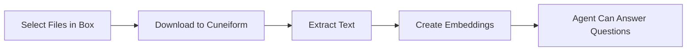

# تكامل Box

استورد المستندات من Box لتدريب الـ Agents لديك.

## نظرة عامة

اربط حساب Box الخاص بك بـ Cuneiform Chat واستورد المستندات مباشرة إلى محتواك. يمكن للـ Agent بعد ذلك الإجابة عن الأسئلة بناءً على محتوى هذه المستندات.

## البدء

### الخطوة 1: الانتقال إلى Content

1. سجّل الدخول إلى [Cuneiform Chat](https://admin.cuneiform.chat)
2. انتقل إلى **Content** في الشريط الجانبي
3. ابحث عن أيقونات التخزين السحابي في أعلى الصفحة

### الخطوة 2: ربط Box

1. انقر على **أيقونة Box** في صفّ أيقونات التخزين السحابي
2. سجّل الدخول بحساب Box الخاص بك (إن طُلِب منك ذلك)
3. امنح Cuneiform Chat إذن الوصول إلى ملفاتك

### الخطوة 3: اختيار الملفات

1. استخدم مُنتقي ملفات Box لتصفّح ملفاتك
2. تنقّل عبر المجلدات للعثور على المستندات
3. اختر ملفًا واحدًا أو أكثر للاستيراد
4. انقر لتأكيد اختيارك

### الخطوة 4: المعالجة

بمجرّد الاستيراد:
- تُعالَج المستندات تلقائيًا
- يُستخرَج النصّ ويُفهرَس
- يمكن للـ Agent الإجابة عن الأسئلة حول المحتوى

## أنواع الملفات المدعومة

| الصيغة | الامتداد | ملاحظات |
|--------|-----------|-------|
| PDF | .pdf | نصّ وممسوح ضوئيًا (OCR) |
| Word | .docx، .doc | مستندات Microsoft Word |
| PowerPoint | .pptx، .ppt | شرائح العروض التقديمية |
| Text | .txt | ملفات نصّية بسيطة |
| Markdown | .md | تنسيق Markdown |
| Rich Text | .rtf | Rich Text Format |
| Web/Data | .html، .htm، .json، .xml | صفحات الويب والبيانات المُهيكَلة |

تتوفّر المجموعة نفسها عبر كل مزوّد تخزين سحابي. راجع [الصيغ المدعومة](/knowledge-base/supported-formats) للتفاصيل وحدود حجم الملف لكل خطة.

## الأذونات

يطلب Cuneiform Chat أذونات بالحدّ الأدنى:

- **وصول للقراءة فقط** إلى الملفات التي تختارها
- **لا وصول كتابة** إلى حساب Box الخاص بك
- **لا وصول** إلى الملفات التي لا تختارها صراحة

import { Callout } from 'nextra/components'

<Callout type="info">
  يمكنك إلغاء الوصول في أيّ وقت من Box Settings ← Security ← Connected Apps.
</Callout>

## كيف يعمل

1. **الإذن** — تمنح وصول القراءة عبر OAuth
2. **الاختيار** — تختار ملفات محدّدة عبر مُنتقي Box
3. **التنزيل** — تُنقَل الملفات بأمان
4. **المعالجة** — يُستخرَج النصّ ويُفهرَس
5. **جاهز** — يمكن للـ Agent الآن الإجابة عن الأسئلة

## أفضل الممارسات

- **اختر الملفات ذات الصلة** — استورد فقط المستندات التي يحتاجها الـ Agent
- **نظّم أولًا** — هيكِل مجلدات Box قبل الاستيراد
- **تحقّق من الصيغ** — تأكّد من أنّ الملفات بصيغ مدعومة
- **راقب التقدّم** — تحقّق من معالجة المستندات بنجاح

## استكشاف الأخطاء وإصلاحها

### تعذّر الاتصال بـ Box

- تحقّق من تسجيل دخولك بحساب Box الصحيح
- تأكّد من السماح بالتطبيقات الخارجية في إعدادات Box لديك
- جرّب مسح ملفات تعريف ارتباط المتصفّح وإعادة الاتصال

### عدم استيراد الملفات

- تأكّد من أنّ الملفات بصيغ مدعومة
- تحقّق من امتلاكك إذن الوصول إلى الملفات
- جرّب استيراد ملفات أقلّ دفعة واحدة

### الاستيراد يستغرق وقتًا طويلًا

- تستغرق الملفات الكبيرة وقتًا أطول للمعالجة
- تحقّق من حالة المستند في Content
- تتطلّب ملفات PDF المعقّدة ذات الصور وقت معالجة أطول

## خصوصية البيانات

- لا تُخزَّن الملفات الأصلية بشكل دائم
- يُحتفَظ فقط بتضمينات النصّ المُستخرَج
- تُشفَّر بيانات اعتماد Box الخاصة بك
- لا نصل أبدًا إلى الملفات التي لم تخترها

## بحاجة إلى مساعدة؟

- البريد الإلكتروني: support@cuneiform.chat
- التوثيق: [docs.cuneiform.chat](https://docs.cuneiform.chat)
