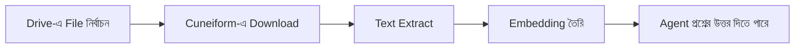

# Google Drive Integration

আপনার AI agent-দের train করতে Google Drive থেকে document import করুন।

## সংক্ষিপ্ত বিবরণ

আপনার Google account Cuneiform Chat-এ সংযুক্ত করুন এবং সরাসরি আপনার content-এ document import করুন। এরপর আপনার AI agent এই document-এর content-এর উপর ভিত্তি করে প্রশ্নের উত্তর দিতে পারবে।

## শুরু করুন

### Step 1: Content-এ Navigate করুন

1. [Cuneiform Chat](https://admin.cuneiform.chat)-এ log in করুন
2. Sidebar-এ **Content**-এ যান
3. Page-এর উপরে cloud storage icon খুঁজুন

### Step 2: Google Drive সংযুক্ত করুন

1. Cloud storage icon row-তে **Google Drive icon**-এ click করুন
2. আপনার Google account দিয়ে sign in করুন (জিজ্ঞাসা করলে)
3. আপনার file access করার জন্য Cuneiform Chat-কে permission দিন

### Step 3: File নির্বাচন করুন

1. আপনার file browse করতে Google Drive file picker ব্যবহার করুন
2. Document খুঁজতে folder-এ navigate করুন
3. এক বা একাধিক file import করতে নির্বাচন করুন
4. নির্বাচন নিশ্চিত করতে click করুন

### Step 4: Processing

Import হওয়ার পর:
- Document স্বয়ংক্রিয়ভাবে process হয়
- Text extract ও index করা হয়
- আপনার agent content সম্পর্কে প্রশ্নের উত্তর দিতে পারে

## Google Workspace File

Native Google Workspace file import-এর সময় স্বয়ংক্রিয়ভাবে রূপান্তরিত হয়:

| File Type | যেভাবে Export হয় |
|-----------|------------------|
| Google Docs | Text content extract করা হয় |
| Google Sheets | Text content extract করা হয় |
| Google Slides | Text content extract করা হয় |

import { Callout } from 'nextra/components'

<Callout type="info">
  Formatting ও chart সংরক্ষিত হয় না — শুধুমাত্র text content extract করা হয়।
</Callout>

## সমর্থিত File Type

| Format | Extension | নোট |
|--------|-----------|------|
| PDF | .pdf | Text ও scanned (OCR) |
| Word | .docx, .doc | সম্পূর্ণ formatting সমর্থন |
| Text | .txt | Plain text file |
| Markdown | .md | Markdown formatting |

সম্পূর্ণ তালিকার জন্য [সমর্থিত Format](/knowledge-base/supported-formats) দেখুন।

## Permission

Cuneiform Chat ন্যূনতম permission অনুরোধ করে:

- আপনি নির্বাচিত file-এ **read-only access**
- আপনার Google Drive-এ **কোনো write access নেই**
- আপনি স্পষ্টভাবে নির্বাচন করেননি এমন file-এ **কোনো access নেই**

<Callout type="info">
  আপনি যেকোনো সময় Google Account → Security → Third-party apps থেকে access প্রত্যাহার করতে পারেন।
</Callout>

## কীভাবে কাজ করে

1. **Authorization** — আপনি OAuth-এর মাধ্যমে read access দেন
2. **Selection** — Google-এর picker-এর মাধ্যমে নির্দিষ্ট file বেছে নিন
3. **Download** — File নিরাপদে transfer করা হয়
4. **Processing** — Text extract ও index করা হয়
5. **Ready** — আপনার agent এখন প্রশ্নের উত্তর দিতে পারে

## সেরা অনুশীলন

- **প্রাসঙ্গিক file নির্বাচন করুন** — শুধুমাত্র আপনার agent-এর প্রয়োজনীয় document import করুন
- **আগে সংগঠিত করুন** — Import-এর আগে আপনার Drive folder সাজান
- **Format পরীক্ষা করুন** — File সমর্থিত format-এ আছে কিনা নিশ্চিত করুন
- **Progress পর্যবেক্ষণ করুন** — Document সফলভাবে process হয়েছে কিনা যাচাই করুন

## সমস্যা সমাধান

### Google Drive-এ সংযোগ করতে পারছেন না

- সঠিক Google account-এ sign in আছেন কিনা যাচাই করুন
- আপনার Google setting-এ third-party app অনুমোদিত কিনা পরীক্ষা করুন
- Browser cookie clear করে পুনরায় সংযোগ করার চেষ্টা করুন

### File Import হচ্ছে না

- File সমর্থিত format-এ আছে কিনা নিশ্চিত করুন
- File access করার permission আছে কিনা পরীক্ষা করুন
- একবারে কম file import করার চেষ্টা করুন

### Import-এ অনেক সময় লাগছে

- বড় file process হতে বেশি সময় লাগে
- Content-এ document status পরীক্ষা করুন
- Image সহ জটিল PDF-এ বেশি processing time প্রয়োজন

## Data Privacy

- মূল file স্থায়ীভাবে সংরক্ষণ করা হয় না
- শুধুমাত্র extract করা text embedding রাখা হয়
- আপনার Google credential encrypted
- আপনি নির্বাচন করেননি এমন file আমরা কখনো access করি না

## সাহায্য প্রয়োজন?

- Email: support@cuneiform.chat
- Documentation: [docs.cuneiform.chat](https://docs.cuneiform.chat)
