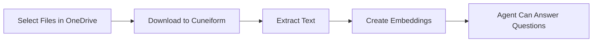

# Integración con OneDrive

Importe documentos desde OneDrive para entrenar a sus AI agents.

## Descripción General

Conecte su cuenta de Microsoft a Cuneiform Chat e importe documentos directamente a su content. Su AI agent podrá entonces responder preguntas basándose en el contenido de estos documentos.

## Primeros Pasos

### Paso 1: Navegar a Knowledge

1. Inicie sesión en [Cuneiform Chat](https://admin.cuneiform.chat)
2. Vaya a **Knowledge** en el menú lateral
3. Busque los iconos de cloud storage en la parte superior de la página

### Paso 2: Conectar OneDrive

1. Haga clic en el **icono de OneDrive** en la fila de iconos de cloud storage
2. Inicie sesión con su cuenta de Microsoft (si se le solicita)
3. Otorgue permiso a Cuneiform Chat para acceder a sus archivos

### Paso 3: Seleccionar Archivos

1. Use el selector de archivos de OneDrive para explorar sus archivos
2. Navegue por las carpetas para encontrar documentos
3. Seleccione uno o más archivos para importar
4. Haga clic para confirmar su selección

### Paso 4: Procesamiento

Una vez importados:
- Los documentos se procesan automáticamente
- El texto se extrae e indexa
- Su agent puede responder preguntas sobre el contenido

## Tipos de Archivo Compatibles

| Formato | Extensión | Notas |
|---------|-----------|-------|
| PDF | .pdf | Texto y escaneado (OCR) |
| Word | .docx, .doc | Soporte completo de formato |
| Texto | .txt | Archivos de texto plano |
| Markdown | .md | Formato Markdown |

Consulte [Formatos Compatibles](/knowledge-base/supported-formats) para la lista completa.

## Permisos

Cuneiform Chat solicita permisos mínimos:

- **Acceso de solo lectura** a los archivos que seleccione
- **Sin acceso de escritura** a su cuenta de OneDrive
- **Sin acceso** a archivos que no elija explícitamente

import { Callout } from 'nextra/components'

<Callout type="info">
  Puede revocar el acceso en cualquier momento desde su Cuenta de Microsoft → Privacidad → Aplicaciones y servicios.
</Callout>

## Cómo Funciona

1. **Autorización** — Otorga acceso de lectura vía OAuth
2. **Selección** — Elige archivos específicos a través del selector de OneDrive
3. **Descarga** — Los archivos se transfieren de forma segura
4. **Procesamiento** — El texto se extrae e indexa
5. **Listo** — Su agent ahora puede responder preguntas

## Mejores Prácticas

- **Seleccione archivos relevantes** — Solo importe documentos que su agent necesite
- **Organice primero** — Estructure sus carpetas de OneDrive antes de importar
- **Verifique los formatos** — Asegúrese de que los archivos estén en formatos compatibles
- **Monitoree el progreso** — Verifique que los documentos se procesen correctamente

## Solución de Problemas

### No se puede conectar a OneDrive

- Verifique que esté conectado a la cuenta de Microsoft correcta
- Compruebe que las aplicaciones de terceros estén permitidas en su configuración de Microsoft
- Intente borrar las cookies del navegador y reconectarse

### Los archivos no se importan

- Confirme que los archivos estén en formatos compatibles
- Verifique que tenga permiso para acceder a los archivos
- Intente importar menos archivos a la vez

### La importación tarda demasiado

- Los archivos grandes tardan más en procesarse
- Verifique el estado del documento en Content
- Los PDFs complejos con imágenes requieren más tiempo de procesamiento

## Privacidad de Datos

- Los archivos originales no se almacenan permanentemente
- Solo se retienen los embeddings de texto extraído
- Sus credenciales de Microsoft están encriptadas
- Nunca accedemos a archivos que no haya seleccionado

## ¿Necesita Ayuda?

- Email: support@cuneiform.chat
- Documentación: [docs.cuneiform.chat](https://docs.cuneiform.chat)
