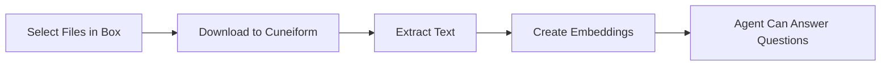

# Box

Importez des documents depuis Box pour entraîner vos agents IA.

## Aperçu

Connectez votre compte Box à Cuneiform Chat et importez des documents directement dans votre contenu. Votre agent IA pourra ensuite répondre aux questions en se basant sur le contenu de ces documents.

## Pour commencer

### Étape 1 : Accéder au Content

1. Connectez-vous à [Cuneiform Chat](https://admin.cuneiform.chat)
2. Allez dans **Content** dans la barre latérale
3. Repérez les icônes de stockage cloud en haut de la page

### Étape 2 : Connecter Box

1. Cliquez sur l'**icône Box** dans la rangée d'icônes de stockage cloud
2. Connectez-vous avec votre compte Box (si demandé)
3. Accordez à Cuneiform Chat la permission d'accéder à vos fichiers

### Étape 3 : Sélectionner les fichiers

1. Utilisez le sélecteur de fichiers Box pour parcourir vos fichiers
2. Naviguez dans les dossiers pour trouver les documents
3. Sélectionnez un ou plusieurs fichiers à importer
4. Cliquez pour confirmer votre sélection

### Étape 4 : Traitement

Une fois importés :
- Les documents sont automatiquement traités
- Le texte est extrait et indexé
- Votre agent peut répondre aux questions sur le contenu

## Types de fichiers pris en charge

| Format | Extension | Notes |
|--------|-----------|-------|
| PDF | .pdf | Texte et numérisé (OCR) |
| Word | .docx, .doc | Support complet du formatage |
| Texte | .txt | Fichiers texte brut |
| Markdown | .md | Formatage Markdown |

Voir [Formats pris en charge](/knowledge-base/supported-formats) pour la liste complète.

## Permissions

Cuneiform Chat demande des permissions minimales :

- **Accès en lecture seule** aux fichiers que vous sélectionnez
- **Aucun accès en écriture** à votre compte Box
- **Aucun accès** aux fichiers que vous ne choisissez pas explicitement

import { Callout } from 'nextra/components'

<Callout type="info">
  Vous pouvez révoquer l'accès à tout moment depuis Paramètres Box → Sécurité → Applications connectées.
</Callout>

## Comment ça fonctionne

1. **Autorisation** — Vous accordez un accès en lecture via OAuth
2. **Sélection** — Choisissez des fichiers spécifiques via le sélecteur Box
3. **Téléchargement** — Les fichiers sont transférés de manière sécurisée
4. **Traitement** — Le texte est extrait et indexé
5. **Prêt** — Votre agent peut maintenant répondre aux questions

## Bonnes pratiques

- **Sélectionnez les fichiers pertinents** — N'importez que les documents dont votre agent a besoin
- **Organisez d'abord** — Structurez vos dossiers Box avant d'importer
- **Vérifiez les formats** — Assurez-vous que les fichiers sont dans des formats pris en charge
- **Surveillez la progression** — Vérifiez que les documents sont traités avec succès

## Dépannage

### Impossible de se connecter à Box

- Vérifiez que vous êtes connecté au bon compte Box
- Vérifiez que les applications tierces sont autorisées dans vos paramètres Box
- Essayez d'effacer les cookies du navigateur et de vous reconnecter

### Les fichiers ne s'importent pas

- Confirmez que les fichiers sont dans des formats pris en charge
- Vérifiez que vous avez la permission d'accéder aux fichiers
- Essayez d'importer moins de fichiers à la fois

### L'import prend trop de temps

- Les fichiers volumineux prennent plus de temps à traiter
- Vérifiez le statut du document dans Content
- Les PDF complexes avec des images nécessitent plus de temps de traitement

## Confidentialité des données

- Les fichiers originaux ne sont pas stockés de manière permanente
- Seuls les embeddings de texte extraits sont conservés
- Vos identifiants Box sont chiffrés
- Nous n'accédons jamais aux fichiers que vous n'avez pas sélectionnés

## Besoin d'aide ?

- Email : support@cuneiform.chat
- Documentation : [docs.cuneiform.chat](https://docs.cuneiform.chat)
