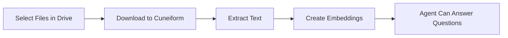

# Google Drive Integration

अपने AI agents को train करने के लिए Google Drive से documents import करें।

## Overview

अपने Google account को Cuneiform Chat से connect करें और documents सीधे अपने content में import करें। आपका AI agent फिर इन documents के content के आधार पर प्रश्नों के उत्तर दे सकता है।

## शुरू करना

### Step 1: Content पर Navigate करें

1. [Cuneiform Chat](https://admin.cuneiform.chat) में log in करें
2. Sidebar में **Content** पर जाएं
3. Page के शीर्ष पर cloud storage icons खोजें

### Step 2: Google Drive से Connect करें

1. Cloud storage icons row में **Google Drive icon** पर click करें
2. अपने Google account से sign in करें (यदि prompt हो)
3. Cuneiform Chat को अपनी files access करने की permission दें

### Step 3: Files Select करें

1. अपनी files browse करने के लिए Google Drive file picker उपयोग करें
2. Documents खोजने के लिए folders में navigate करें
3. Import करने के लिए एक या अधिक files select करें
4. अपना selection confirm करने के लिए click करें

### Step 4: Processing

Import होने के बाद:
- Documents automatically process होते हैं
- Text extract और indexed होता है
- आपका agent content के बारे में प्रश्नों के उत्तर दे सकता है

## Google Workspace Files

Native Google Workspace files import के दौरान automatically convert होती हैं:

| File Type | Exported As |
|-----------|-------------|
| Google Docs | Text content extracted |
| Google Sheets | Text content extracted |
| Google Slides | Text content extracted |

import { Callout } from 'nextra/components'

<Callout type="info">
  Formatting और charts preserved नहीं होते — केवल text content extract किया जाता है।
</Callout>

## समर्थित File Types

| Format | Extension | नोट्स |
|--------|-----------|-------|
| PDF | .pdf | Text और scanned (OCR) |
| Word | .docx, .doc | Full formatting support |
| Text | .txt | Plain text files |
| Markdown | .md | Markdown formatting |

पूरी सूची के लिए [समर्थित प्रारूप](/knowledge-base/supported-formats) देखें।

## Permissions

Cuneiform Chat minimal permissions request करता है:

- आप जो files select करते हैं उनका **Read-only access**
- आपके Google Drive का **No write access**
- जो files आप explicitly choose नहीं करते उनका **No access**

<Callout type="info">
  आप किसी भी समय अपने Google Account → Security → Third-party apps से access revoke कर सकते हैं।
</Callout>

## यह कैसे काम करता है

1. **Authorization** — आप OAuth के माध्यम से read access grant करते हैं
2. **Selection** — Google के picker के माध्यम से specific files चुनें
3. **Download** — Files securely transfer होती हैं
4. **Processing** — Text extract और indexed होता है
5. **Ready** — आपका agent अब प्रश्नों के उत्तर दे सकता है

## Best Practices

- **Relevant files select करें** — केवल वे documents import करें जिनकी आपके agent को जरूरत है
- **पहले organize करें** — Import करने से पहले अपने Drive folders structure करें
- **Formats check करें** — सुनिश्चित करें कि files supported formats में हैं
- **Progress monitor करें** — Verify करें कि documents successfully process हों

## Troubleshooting

### Google Drive से Connect नहीं हो पा रहा

- Verify करें कि आप सही Google account में sign in हैं
- Check करें कि third-party apps आपके Google settings में allowed हैं
- Browser cookies clear करके reconnect करने की कोशिश करें

### Files Import नहीं हो रहीं

- Confirm करें कि files supported formats में हैं
- Check करें कि आपके पास files access करने की permission है
- एक साथ कम files import करने की कोशिश करें

### Import बहुत धीमा है

- Large files को process होने में अधिक समय लगता है
- Content में document status check करें
- Images वाले complex PDFs को अधिक processing time चाहिए

## Data Privacy

- Original files permanently store नहीं होतीं
- केवल extracted text embeddings retain होते हैं
- आपके Google credentials encrypted होते हैं
- हम उन files access नहीं करते जो आपने select नहीं की हैं

## सहायता चाहिए?

- Email: support@cuneiform.chat
- Documentation: [docs.cuneiform.chat](https://docs.cuneiform.chat)
