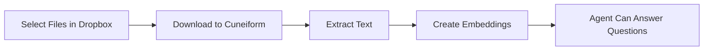

# Integração com Dropbox

Importe documentos do Dropbox para treinar seus agents de AI.

## Visão Geral

Conecte sua conta Dropbox ao Cuneiform Chat e importe documentos diretamente para seu conteúdo. Seu agent de AI pode então responder perguntas com base no conteúdo desses documentos.

## Primeiros Passos

### Passo 1: Navegue até Content

1. Faça login em [Cuneiform Chat](https://admin.cuneiform.chat)
2. Vá até **Content** na barra lateral
3. Procure os ícones de cloud storage no topo da página

### Passo 2: Conecte o Dropbox

1. Clique no **ícone do Dropbox** na linha de ícones de cloud storage
2. Faça login com sua conta Dropbox (se solicitado)
3. Conceda permissão ao Cuneiform Chat para acessar seus arquivos

### Passo 3: Selecione Arquivos

1. Use o seletor de arquivos do Dropbox para navegar pelos seus arquivos
2. Navegue pelas pastas para encontrar documentos
3. Selecione um ou mais arquivos para importar
4. Clique para confirmar sua seleção

### Passo 4: Processamento

Uma vez importados:
- Documentos são automaticamente processados
- O texto é extraído e indexado
- Seu agent pode responder perguntas sobre o conteúdo

## Tipos de Arquivo Suportados

| Formato | Extensão | Notas |
|---------|----------|-------|
| PDF | .pdf | Texto e digitalizado (OCR) |
| Word | .docx, .doc | Suporte completo de formatação |
| Text | .txt | Arquivos de texto simples |
| Markdown | .md | Formatação Markdown |

Veja [Formatos Suportados](/pt/knowledge-base/supported-formats) para a lista completa.

## Permissões

Cuneiform Chat solicita permissões mínimas:

- **Acesso somente leitura** aos arquivos que você selecionar
- **Sem acesso de escrita** à sua conta Dropbox
- **Sem acesso** a arquivos que você não escolher explicitamente

import { Callout } from 'nextra/components'

<Callout type="info">
  Você pode revogar o acesso a qualquer momento em Dropbox Settings → Connected apps.
</Callout>

## Como Funciona

1. **Autorização** — Você concede acesso de leitura via OAuth
2. **Seleção** — Escolha arquivos específicos pelo seletor do Dropbox
3. **Download** — Arquivos são transferidos com segurança
4. **Processamento** — O texto é extraído e indexado
5. **Pronto** — Seu agent agora pode responder perguntas

## Boas Práticas

- **Selecione arquivos relevantes** — Importe apenas documentos que seu agent precisa
- **Organize primeiro** — Estruture suas pastas no Dropbox antes de importar
- **Verifique formatos** — Certifique-se de que os arquivos estão em formatos suportados
- **Acompanhe o progresso** — Verifique se os documentos são processados com sucesso

## Solução de Problemas

### Não Consigo Conectar ao Dropbox

- Verifique se está logado na conta Dropbox correta
- Confirme que aplicativos de terceiros são permitidos nas suas configurações do Dropbox
- Tente limpar os cookies do navegador e reconectar

### Arquivos Não Importam

- Confirme que os arquivos estão em formatos suportados
- Verifique se você tem permissão para acessar os arquivos
- Tente importar menos arquivos de uma vez

### Importação Demorando Muito

- Arquivos grandes levam mais tempo para processar
- Verifique o status do documento no Content
- PDFs complexos com imagens requerem mais tempo de processamento

## Privacidade de Dados

- Arquivos originais não são armazenados permanentemente
- Apenas embeddings de texto extraído são retidos
- Suas credenciais do Dropbox são criptografadas
- Nunca acessamos arquivos que você não selecionou

## Precisa de Ajuda?

- Email: support@cuneiform.chat
- Documentação: [docs.cuneiform.chat](https://docs.cuneiform.chat)
