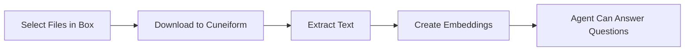

# Интеграция с Box

Импортируйте документы из Box для обучения ваших ИИ-агентов.

## Обзор

Подключите свой аккаунт Box к Cuneiform Chat и импортируйте документы напрямую в ваш контент. После этого ваш ИИ-агент сможет отвечать на вопросы на основе содержимого этих документов.

## Начало работы

### Шаг 1: Перейдите в раздел Content

1. Войдите в [Cuneiform Chat](https://admin.cuneiform.chat)
2. Перейдите в раздел **Content** на боковой панели
3. Найдите значки облачных хранилищ в верхней части страницы

### Шаг 2: Подключите Box

1. Нажмите на значок **Box** в ряду значков облачных хранилищ
2. Войдите в свой аккаунт Box (при необходимости)
3. Предоставьте Cuneiform Chat разрешение на доступ к вашим файлам

### Шаг 3: Выберите файлы

1. Используйте средство выбора файлов Box для просмотра ваших файлов
2. Перемещайтесь по папкам для поиска документов
3. Выберите один или несколько файлов для импорта
4. Нажмите для подтверждения выбора

### Шаг 4: Обработка

После импорта:
- Документы обрабатываются автоматически
- Текст извлекается и индексируется
- Ваш агент может отвечать на вопросы по содержимому

## Поддерживаемые типы файлов

| Формат | Расширение | Примечания |
|--------|-----------|------------|
| PDF | .pdf | Текст и сканированные документы (OCR) |
| Word | .docx, .doc | Полная поддержка форматирования |
| Text | .txt | Простые текстовые файлы |
| Markdown | .md | Форматирование Markdown |

Полный список см. в разделе [Поддерживаемые форматы](/ru/knowledge-base/supported-formats).

## Разрешения

Cuneiform Chat запрашивает минимальные разрешения:

- **Доступ только для чтения** к выбранным вами файлам
- **Без доступа на запись** к вашему аккаунту Box
- **Без доступа** к файлам, которые вы явно не выбрали

import { Callout } from 'nextra/components'

<Callout type="info">
  Вы можете отозвать доступ в любое время в Box Settings → Security → Connected Apps.
</Callout>

## Как это работает

1. **Авторизация** — вы предоставляете доступ на чтение через OAuth
2. **Выбор** — выберите нужные файлы через средство выбора Box
3. **Загрузка** — файлы безопасно передаются
4. **Обработка** — текст извлекается и индексируется
5. **Готово** — ваш агент теперь может отвечать на вопросы

## Лучшие практики

- **Выбирайте нужные файлы** — импортируйте только документы, необходимые вашему агенту
- **Сначала организуйте** — упорядочьте папки в Box перед импортом
- **Проверяйте форматы** — убедитесь, что файлы в поддерживаемых форматах
- **Отслеживайте прогресс** — проверяйте успешность обработки документов

## Устранение неполадок

### Не удается подключиться к Box

- Убедитесь, что вы вошли в правильный аккаунт Box
- Проверьте, что сторонние приложения разрешены в настройках Box
- Попробуйте очистить cookies браузера и подключиться заново

### Файлы не импортируются

- Убедитесь, что файлы в поддерживаемых форматах
- Проверьте, что у вас есть доступ к этим файлам
- Попробуйте импортировать меньше файлов за раз

### Импорт занимает слишком много времени

- Большие файлы обрабатываются дольше
- Проверьте статус документа в разделе Content
- Сложные PDF с изображениями требуют больше времени на обработку

## Конфиденциальность данных

- Оригинальные файлы не хранятся на постоянной основе
- Сохраняются только извлеченные текстовые embeddings
- Ваши учетные данные Box зашифрованы
- Мы никогда не обращаемся к файлам, которые вы не выбрали

## Нужна помощь?

- Email: support@cuneiform.chat
- Документация: [docs.cuneiform.chat](https://docs.cuneiform.chat)
