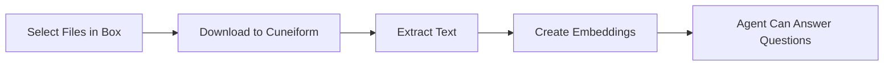

# Box Integration

Import เอกสารจาก Box เพื่อฝึก AI agent ของคุณ

## ภาพรวม

เชื่อมต่อบัญชี Box ของคุณกับ Cuneiform Chat และ import เอกสารโดยตรงเข้าสู่เนื้อหา AI agent ของคุณจะสามารถตอบคำถามจากเนื้อหาของเอกสารเหล่านี้ได้

## เริ่มต้นใช้งาน

### ขั้นตอนที่ 1: ไปที่ Content

1. เข้าสู่ระบบ [Cuneiform Chat](https://admin.cuneiform.chat)
2. ไปที่ **Content** ในเมนู sidebar
3. มองหาไอคอน Cloud Storage ที่ด้านบนของหน้า

### ขั้นตอนที่ 2: เชื่อมต่อ Box

1. คลิก **ไอคอน Box** ในแถวไอคอน Cloud Storage
2. เข้าสู่ระบบด้วยบัญชี Box ของคุณ (หากถูกขอ)
3. อนุญาตให้ Cuneiform Chat เข้าถึงไฟล์ของคุณ

### ขั้นตอนที่ 3: เลือกไฟล์

1. ใช้ Box file picker เพื่อเรียกดูไฟล์
2. เรียกดูโฟลเดอร์เพื่อค้นหาเอกสาร
3. เลือกไฟล์หนึ่งไฟล์หรือมากกว่าเพื่อ import
4. คลิกเพื่อยืนยันการเลือก

### ขั้นตอนที่ 4: การประมวลผล

เมื่อ import แล้ว:
- เอกสารจะถูกประมวลผลโดยอัตโนมัติ
- ข้อความจะถูกดึงและจัดทำ index
- Agent ของคุณสามารถตอบคำถามเกี่ยวกับเนื้อหาได้

## ประเภทไฟล์ที่รองรับ

| รูปแบบ | นามสกุล | หมายเหตุ |
|--------|---------|----------|
| PDF | .pdf | แบบข้อความและสแกน (OCR) |
| Word | .docx, .doc | รองรับการจัดรูปแบบเต็มรูปแบบ |
| Text | .txt | ไฟล์ข้อความธรรมดา |
| Markdown | .md | รูปแบบ Markdown |

ดู [รูปแบบที่รองรับ](/knowledge-base/supported-formats) สำหรับรายการทั้งหมด

## สิทธิ์การเข้าถึง

Cuneiform Chat ขอสิทธิ์ขั้นต่ำ:

- **สิทธิ์อ่านอย่างเดียว** สำหรับไฟล์ที่คุณเลือก
- **ไม่มีสิทธิ์เขียน** ไปยังบัญชี Box ของคุณ
- **ไม่มีการเข้าถึง** ไฟล์ที่คุณไม่ได้เลือกโดยชัดแจ้ง

import { Callout } from 'nextra/components'

<Callout type="info">
  คุณสามารถเพิกถอนสิทธิ์การเข้าถึงได้ตลอดเวลาจาก Box Settings → Security → Connected Apps
</Callout>

## วิธีการทำงาน

1. **Authorization** — คุณอนุญาตสิทธิ์อ่านผ่าน OAuth
2. **Selection** — เลือกไฟล์เฉพาะผ่าน Box picker
3. **Download** — ไฟล์ถูกโอนอย่างปลอดภัย
4. **Processing** — ข้อความถูกดึงและจัดทำ index
5. **Ready** — Agent ของคุณสามารถตอบคำถามได้แล้ว

## แนวปฏิบัติที่ดี

- **เลือกไฟล์ที่เกี่ยวข้อง** — Import เฉพาะเอกสารที่ agent ต้องการ
- **จัดระเบียบก่อน** — จัดโครงสร้างโฟลเดอร์ Box ก่อน import
- **ตรวจสอบรูปแบบ** — ตรวจสอบว่าไฟล์อยู่ในรูปแบบที่รองรับ
- **ติดตามความคืบหน้า** — ตรวจสอบว่าเอกสารประมวลผลสำเร็จ

## การแก้ไขปัญหา

### เชื่อมต่อ Box ไม่ได้

- ตรวจสอบว่าเข้าสู่ระบบบัญชี Box ที่ถูกต้อง
- ตรวจสอบว่าอนุญาตแอปของบุคคลที่สามในการตั้งค่า Box
- ลองล้าง cookie เบราว์เซอร์และเชื่อมต่อใหม่

### ไฟล์ไม่ถูก import

- ยืนยันว่าไฟล์อยู่ในรูปแบบที่รองรับ
- ตรวจสอบว่าคุณมีสิทธิ์เข้าถึงไฟล์
- ลอง import ไฟล์น้อยลงในแต่ละครั้ง

### Import ใช้เวลานาน

- ไฟล์ขนาดใหญ่ใช้เวลาประมวลผลนานขึ้น
- ตรวจสอบสถานะเอกสารใน Content
- PDF ที่ซับซ้อนพร้อมรูปภาพต้องการเวลาประมวลผลมากขึ้น

## ความเป็นส่วนตัวของข้อมูล

- ไฟล์ต้นฉบับไม่ถูกจัดเก็บถาวร
- เก็บรักษาเฉพาะ text embedding ที่ดึงออกมา
- ข้อมูลรับรอง Box ของคุณถูกเข้ารหัส
- เราไม่เข้าถึงไฟล์ที่คุณไม่ได้เลือก

## ต้องการความช่วยเหลือ?

- อีเมล: support@cuneiform.chat
- เอกสาร: [docs.cuneiform.chat](https://docs.cuneiform.chat)
