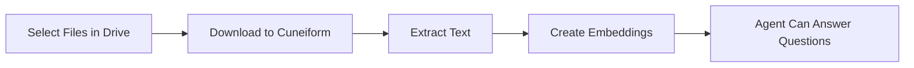

# Google Drive Integration

Import documents from Google Drive to train your AI agents.

## Overview

Connect your Google account to Cuneiform Chat and import documents directly into your knowledge base. Your AI agent can then answer questions based on the content of these documents.

## Getting Started

### Step 1: Navigate to Knowledge Base

1. Log in to [Cuneiform Chat](https://admin.cuneiform.chat)
2. Go to **Knowledge Base** in the sidebar
3. Click **Add Source** or **Import from Cloud**

### Step 2: Connect Google Drive

1. Select **Google Drive** from the cloud storage options
2. Click **Connect** to open the Google authorization window
3. Sign in with your Google account
4. Grant Cuneiform Chat permission to access your files

### Step 3: Select Files

1. Use the Google Drive file picker to browse your files
2. Select the documents you want to import
3. Click **Import** to start the process

### Step 4: Processing

Once imported:
- Documents are automatically processed
- Text is extracted and indexed
- Your agent can answer questions about the content

## Google Workspace Files

Native Google Workspace files are automatically converted during import:

| File Type | Exported As |
|-----------|-------------|
| Google Docs | Text content extracted |
| Google Slides | Text content extracted |

import { Callout } from 'nextra/components'

<Callout type="info">
  Formatting and charts are not preserved — only the text content is extracted.
</Callout>

## Supported File Types

| Format | Extension | Notes |
|--------|-----------|-------|
| PDF | .pdf | Text and scanned (OCR) |
| Word | .docx, .doc | Full formatting support |
| Text | .txt | Plain text files |
| Markdown | .md | Markdown formatting |

See [Supported Formats](/knowledge-base/supported-formats) for the complete list.

## Permissions

Cuneiform Chat requests minimal permissions:

- **Read-only access** to files you select
- **No write access** to your Google Drive
- **No access** to files you don't explicitly choose

<Callout type="info">
  You can revoke access at any time from your Google Account → Security → Third-party apps.
</Callout>

## How It Works

1. **Authorization** — You grant read access via OAuth
2. **Selection** — Choose specific files through Google's picker
3. **Download** — Files are securely transferred
4. **Processing** — Text is extracted and indexed
5. **Ready** — Your agent can now answer questions

## Best Practices

- **Select relevant files** — Only import documents your agent needs
- **Organize first** — Structure your Drive folders before importing
- **Check formats** — Ensure files are in supported formats
- **Monitor progress** — Verify documents process successfully

## Troubleshooting

### Can't Connect to Google Drive

- Verify you're signed into the correct Google account
- Check that third-party apps are allowed in your Google settings
- Try clearing browser cookies and reconnecting

### Files Not Importing

- Confirm files are in supported formats
- Check you have permission to access the files
- Try importing fewer files at once

### Import Taking Too Long

- Large files take longer to process
- Check the document status in Knowledge Base
- Complex PDFs with images require more processing time

## Data Privacy

- Original files are not permanently stored
- Only extracted text embeddings are retained
- Your Google credentials are encrypted
- We never access files you haven't selected

## Need Help?

- Email: support@cuneiform.chat
- Documentation: [docs.cuneiform.chat](https://docs.cuneiform.chat)
